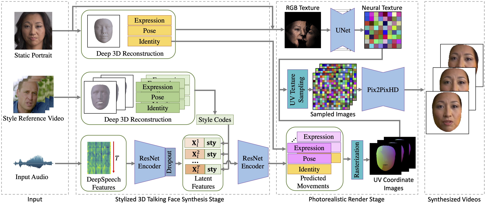

# style_avatar
A repository for generating stylized talking 3D faces and 2D videos. 
This is the repository for paper *Imitating Arbitrary Talking Style for Realistic Audio-Driven Talking Face Synthesis, MM 2021*
The demo video can be viewed in this link: https://hcsi.cs.tsinghua.edu.cn/demo/MM21-HAOZHEWU.mp4.



------

### Quick start

#### Installation
```
conda create -n python36 python=3.6 
conda activate python36
```
- Install necessary packages through `pip install -r requirements.txt`
- Download the pretrained deepspeech model from the [Link](https://github.com/mozilla/DeepSpeech/releases/download/v0.9.2/deepspeech-0.9.2-checkpoint.tar.gz), and then unzip the zipped file to `./deepspeech` folder.
- Same as the instructions of [Deep 3D Face Reconstruction](https://github.com/microsoft/Deep3DFaceReconstruction).
  - Download the Basel Face Model. Due to the license agreement of Basel Face Model, you have to download the BFM09 model after submitting an application on its [home page](https://faces.dmi.unibas.ch/bfm/main.php?nav=1-2&id=downloads). After getting the access to BFM data, download "01_MorphableModel.mat" and put it into ./deep_3drecon/BFM subfolder.
  - Download Download the Expression Basis provided by [Guo et al](https://github.com/Juyong/3DFace). You can find a link named "CoarseData" in the first row of Introduction part in their repository. Download and unzip the Coarse_Dataset.zip. Put "Exp_Pca.bin" into ./deep_3drecon/BFM subfolder. The expression basis are constructed using [Facewarehouse](http://kunzhou.net/zjugaps/facewarehouse/) data and transferred to BFM topology.
  Download the pre-trained [reconstruction network](https://drive.google.com/file/d/176LCdUDxAj7T2awQ5knPMPawq5Q2RUWM/view), unzip it and put "FaceReconModel.pb" into ./deep_3drecon/network subfolder.
  - Run `git lfs checkout ./deep_3drecon/BFM/BFM_model_front.mat`
- Download the pretrained [audio2motion model](https://cloud.tsinghua.edu.cn/f/acb6d482a26e4eb8b116/?dl=1), put it into `./audio2motion/model`
- Download the pretrained [texture encoder](https://cloud.tsinghua.edu.cn/f/c60a3466016948c48951/?dl=1) and [render](https://cloud.tsinghua.edu.cn/f/106023055772444f8f15/?dl=1), put it into `./render/model`

#### Run
To run our demo, you need at least one GPU with 11G GPU memory.
```
python demo.py --in_img [*.png] --in_audio [*.wav] --output_path [path]
```
We provide 10 example talking styles in `style.npy`, you can also calculate your own style codes with the following code. Where the exp is the 3DMM series and pose is the pose matrix reconstructed from [Deep 3D Face Reconstruction](https://github.com/microsoft/Deep3DFaceReconstruction). Usually we calculate style codes with videos of 5-20 seconds.

```python
def get_style_code(exp, pose):
  exp_mean_std = pkl.load(open("./data/ted_hd/exp_mean_std.pkl", 'rb'))
  exp_std_mean = exp_mean_std['s_m']
  exp_std_std = exp_mean_std['s_s']
  exp_diff_std_mean = exp_mean_std['d_s_m']
  exp_diff_std_std = exp_mean_std['d_s_s']

  pose_mean_std = pkl.load(open("./data/ted_hd/pose_mean_std.pkl", 'rb'))
  pose_diff_std_mean = pose_mean_std['d_s_m']
  pose_diff_std_std = pose_mean_std['d_s_s']

  diff_exp = exp[:-1, :] - exp[1:, :]
  exp_std = (np.std(exp, axis = 0) - exp_std_mean) / exp_std_std
  diff_exp_std = (np.std(diff_exp, axis = 0) - exp_diff_std_mean) / exp_diff_std_std

  diff_pose = pose[:-1, :] - pose[1:, :]
  diff_pose_std = (np.std(diff_pose, axis = 0) - pose_diff_std_mean) / pose_diff_std_std

  return np.concatenate((exp_std, diff_exp_std, diff_pose_std))
```

Notice that the pose of each talking face is static in current demo, you can control the pose of face by modifying the coeff_array in demo.py in line 93. The coeff_array has shape of $N * 257$ , where $N$ is framesize, vector of $257$ dimensions has same definition as [deep 3d face reconstruction](https://github.com/microsoft/Deep3DFaceReconstruction), where $254-257$ dim controls the translation, and $224-227$ dim controls euler angles for pose.

------

### Project Overview

Our project organizes the files as follows:

```
├── README.md
├── data_process
├── deepspeech
├── face_alignment
├── deep_3drecon
├── render
├── audio2motion
```

#### Data process
The data process folder contains processing code of several datasets.

#### DeepSpeech

We leverage the [DeepSpeech](https://github.com/mozilla/DeepSpeech) project to extract audio related features. Please download the pretrained deepspeech model from the [Link](https://github.com/mozilla/DeepSpeech/releases/download/v0.9.2/deepspeech-0.9.2-checkpoint.tar.gz). In `deepspeech/evaluate.py`, we implement the funtion `get_prob` to get the latent deepspeech features with input audio path. The latent deepspeech features have 50 frames per second. We should align the deepspeech features to 25 fps videos in subsequent implementations. 

#### Face Alignment

We modify [Face Alignment](https://github.com/1adrianb/face-alignment) for data preprocess. Different from the original project, we enforce the face alignment to detect only the largest face in each frame for speed-up.

#### Deep 3D Face Reconstruction

We modify [Deep 3D Face Reconstruction](https://github.com/microsoft/Deep3DFaceReconstruction) for data preprocess. We add  batch-api, uv-texture unwarpping api and uv coodinate image generation api in `deep_3drecon/utils.py`.

#### Render

We implement our texture encoder and rendering model in the render folder. We also implement some other renders like [neural voice puppertry](https://arxiv.org/abs/1912.05566).

#### Audio to Motion

We implement our stylized audio to facial motion model in audio2motion folder.

------
### Data

#### Ted-HD data
We leverage `lmdb` to store the fragmented data. The data can be downloaded from [link](https://cloud.tsinghua.edu.cn/d/b046cc3ee1774beb9511/), and then run `cat xa* > data.mdb`. You can obtain the train/test video with the code bellow. We use the Ted-HD data to train the audio2motion model. We also provide the reconstructed 3D param and landmarks in the lmdb.
```python
import lmdb

def test():
    lmdb_path = "./lmdb"
    env = lmdb.open(lmdb_path, map_size=1099511627776, max_dbs = 64)

    train_video = env.open_db("train_video".encode())
    train_audio = env.open_db("train_audio".encode())
    train_lm5 = env.open_db("train_lm5".encode())
    test_video = env.open_db("test_video".encode())
    test_audio = env.open_db("test_audio".encode())
    test_lm5 = env.open_db("test_lm5".encode())

    with env.begin(write = False) as txn:
        video = txn.get(str(0).encode(), db=test_video)
        audio = txn.get(str(0).encode(), db=test_audio)
        video_file = open("test.mp4", "wb")
        audio_file = open("test.wav", "wb")
        video_file.write(video)
        audio_file.write(audio)
        video_file.close()
        audio_file.close()
        print(txn.stat(db=train_video))
        print(txn.stat(db=test_video)) # we can obtain the database size here  
```

For the training of render, we will not provide the processed dataset due to the license of [LRW](https://www.robots.ox.ac.uk/~vgg/data/lip_reading/lrw1.html).

------
### Citation

```
@inproceedings{wu2021imitating,
  title={Imitating Arbitrary Talking Style for Realistic Audio-Driven Talking Face Synthesis},
  author={Wu, Haozhe and Jia, Jia and Wang, Haoyu and Dou, Yishun and Duan, Chao and Deng, Qingshan},
  booktitle={Proceedings of the 29th ACM International Conference on Multimedia},
  pages={1478--1486},
  year={2021}
}
```

------
### Further works

- Current render is still buggy, there are noisy dots in the synthesized videos, we will fix this problem.
- We will optimize the rendering results of particular person with video footage of only 2-3 seconds.
- We will blend the synthesized results with backgrounds.
- We will add controllable dynamic textures and light control.